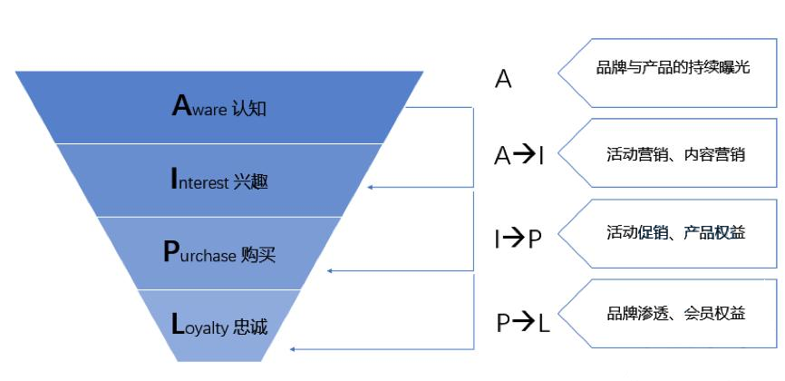
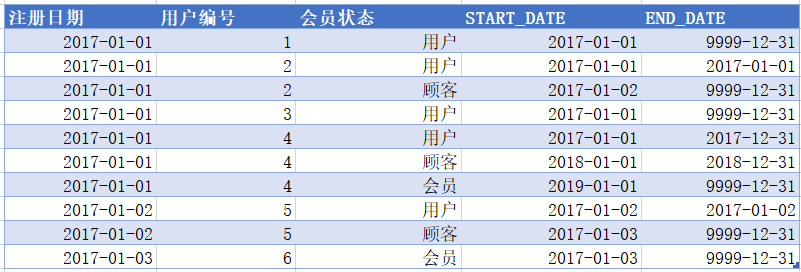
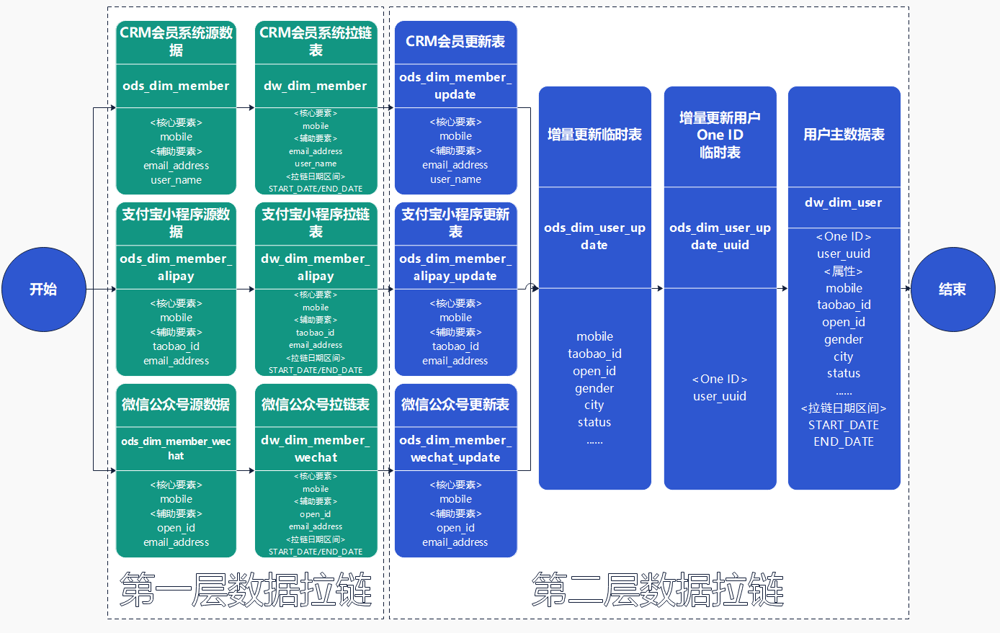
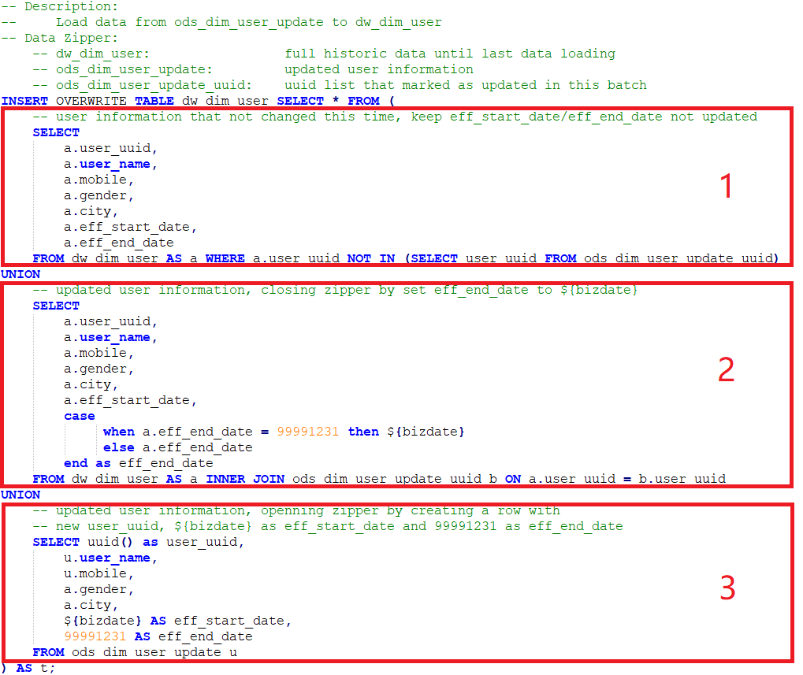

## OneID
基于拉链处理方式的ONE ID大数据整合模型

## Key Words
- [x] MDM:	Master Data Management, 主数据管理
- [x] One ID:	One Identifier, 统一标识
- [x] AIPL:	Awareness, Interest, Purchase, Loyalty, 客户生命周期模型，从认知、兴趣、购买到忠诚
- [x] Data Lake:	Data Lake, 数据湖
- [x] Cloud Data Warehouse:	Cloud Data Warehouse, 云化数仓
- [x] KG:	Knowledge Graph, 知识图谱
- [x] Zipper Table:	Zipper Table, 拉链表
- [x] Primary Element:	Primary Element, 核心要素
- [x] Secondary Element:	Secondary Element, 辅助要素
- [x] UUID:	Universally Unique Identifier, 通用唯一识别码

## 1.1 背景技术
主数据（MD: Master Data）指系统间的分享数据（例如，客户、产品、供应商和渠道等），经典主数据的例子就是客户，我们都了解客户数据，我们都是别人的客户，客户是MDM（Master Data Management）的项目中心。同时还有其它各种各样的主数据，比如说产品数据、地点、资产、员工等等，这些主数据是相互联系的，因为客户买产品，供应商卖产品等等，所以MDM管理的不仅仅是客户的数据、产品的数据，还有其它相关的数据。

客户作为MDM管理的核心主数据之一，是存在生命周期的。客户生命周期是指从一个客户开始对企业进行了解或企业欲对某一客户进行开发开始，直到客户与企业的业务关系完全终止且与之相关的事宜完全处理完毕的这段时间。客户生命周期描述的是客户关系从一种状态（一个阶段）向另一种状态（另一个阶段）运动的总体特征，客户状态转变的模型AIPL就是该运动特征的经典阐述，其中A代表认知（Awareness）、 I代表兴趣（Interest）、P代表购买（Purchase）和 L代表忠诚（Loyalty），描述的用户从看到品牌、对品牌旗下产品产生兴趣、购买产品到最终成为品牌忠诚会员的成长过程。

在这个过程中，品牌方通过不同的渠道与客户产生接触与联系。随着移动互联网技术的发展和数字科技的推动，移动应用成为品牌与客户连接的重要渠道，但由于品牌发展的过程中各渠道触点业务各自发展，企业触点数据割裂、个性化营销能力薄弱、品牌与渠道商联动不足的问题逐渐显现，主要体现在渠道之间、数字化系统之间的用户ID体系各自为战，呈现多样化、碎片化和孤岛化的特点。

在此背景下，One ID（One Identifier）被提出用于解决此类问题，而本项目也以客户主数据为主要案例来阐述相应的方法论。简单来说，用户和设备等业务实体，在对应的业务数据中，会被映射为唯一识别（One ID）上，其各个维度的数据通过One ID进行关联，基于手机号、身份证、邮箱、设备ID等信息，结合业务规则进行 ID-Mapping，将各种 ID 都映射到统一One ID上，通过这个统一One ID，便可在企业级的数据湖（Data Lake）和云化数仓（Cloud Data Warehouse）建设过程中，在主数据层面打通数据之间的孤岛。

## 1.2 现有的技术方案
知识图谱（KG: Knowledge Graph），在图书情报界称为知识域可视化或知识领域映射地图，是显示知识发展进程与结构关系的一系列各种不同的图形，用可视化技术描述知识资源及其载体，挖掘、分析、构建、绘制和显示知识及它们之间的相互联系。

知识图谱可以应用到One ID的大数据整合模型当中，通过将应用数学、图形学、信息可视化技术、信息科学等学科的理论与方法与计量学引文分析、共现分析等方法结合，并利用可视化的图谱形象地展示用户在生命周期当中从用户到客户的转化过程，并且进行One ID信息的整合。

- 基于知识图谱的技术方案，从架构的角度，在数据湖和云化数仓的架构上需额外再引入图数据库架构，增加了架构的复杂度和系统运维的难度。
- 基于知识图谱的点边特性，以图连通的方式来具体化一个实体的个人，从实操层面上还没有解决点边权重设计的相关难点问题，实际落地较难。

## 2.1 本项目所要解决的技术问题
本项目设计一种企业主数据信息的双层数据拉链处理集成技术，提供了一种基于数据湖和云化数仓的大数据平台One ID建模的实现方法，充分利用大数据平台的规模优势，在互联网时代处理大体量的网络用户通过手机App、小程序、公众号等渠道与品牌互动过程中，从品牌的认知用户到忠诚会员的全生命周期管理，赋能AIPL转化漏斗模型相关的经典应用场景。

同时，该One ID大数据整合模型能延伸应用到集团一体化的场景中，从MDM角度整合集团旗下各子公司的主数据，解决集团化公司的数据孤岛问题，为母子公司业务联动打好坚实的数据基础。

## 2.2 本项目提供的完整技术方案
拉链表（Zipper Table）是针对数据仓库设计中表存储数据的方式而定义的，顾名思义，所谓拉链，就是记录一个事物从开始，一直到当前状态的所有变化的历史信息。

以上图2是用户拉链表的示例，其中：会员状态表示该人员在AIPL转化漏斗模型当中的状态信息，START_DATE表示该条记录的生命周期开始生效时间，END_DATE表示该条记录的生命周期结束生效时间。

## 2.2.1 用户主数据表One ID整合模型流程

以上是以用户主数据表为例来展示One ID整合模型的流程图，其中：
- 第一层数据拉链模型，用于在CRM会员系统、支付宝小程序和微信公众号的各个源系统中采集源数据（ods表），并经过集成之后形成各自的拉链表（dw表），并标记当前批次的新数据（END_DATE为9999/12/31）；
- 第二层数据拉链模型，用于融合贯通来自CRM会员系统、支付宝小程序和微信公众号的用户数据，形成用户One ID的整合数据拉链模型表（dw_dim_user）。
- 核心要素（Primary Element）是指认定为具备身份唯一识别信息的要素，本方案中是以手机号（mobile）为例；
- 辅助要素（Secondary Element）是指不具备唯一身份识别信息，但可以提供辅助身份识别信息的要素；
- ods_dim_member为CRM会员系统的会员相关主数据表，包含手机号（mobile）作为核心要素，邮箱地址（email_address）和姓名（user_name）作为辅助要素；
- ods_dim_member_alipay为支付宝小程序联名会员相关主数据表，包含手机号（mobile）作为核心要素，淘宝ID（taobao_id）和邮箱地址（email_address）作为辅助要素；
- ods_dim_member_wechat为微信公众号的联名会员相关主数据表，包含手机号（mobile）作为核心要素，微信Open ID（open_id）和邮箱地址（email_address）作为辅助要素；
- ods_dim_user_update为增量更新临时表，仅记录本批次待更新的用户信息；
ods_dim_user为用户主数据表，包含1）用户One ID（user_uuid）， 2）属性信息，例如：手机号（mobile）、淘宝ID（taobao_id）、微信Open ID（open_id）、邮箱地址（email_address）、性别（gender）、城市（city）和AIPL转化状态（status）等， 3）拉链日期区间信息：START_DATE表示该条记录的生命周期开始生效时间，END_DATE表示该条记录的生命周期结束生效时间；

## 2.2.2 用户主数据表One ID整合模型流程

以上步骤用于用户主数据拉链表数据集成，整段逻辑分为3部分： 
- 第1部分，对于本批次无更新的用户，保留原有的start_date和end_date做为开闭链时间，One ID和其余属性信息均保持不变；
- 第2部分，对于本批次信息有更新的用户，以原有start_date为开链日期、以当期日期（参数${bizdate}）为闭链日期赋值end_date，关闭当前记录拉链，将One ID和其余属性状态尘封为历史信息；
- 第3部分，对于本批次信息有更新的用户和新增的用户，以当期日期（参数${bizdate}）赋值start_date为开链日期、以99991231为闭链日期赋值end_date。

## 2.2.3 用户One ID数据更新场景场景说明

常规数据拉链场景：
以上图5中展示的是常规数据拉链场景下、One ID整合模型下数据在第一天和第二天的具体变化描述，其中： 
- 第一天，存在u001, u002和u003三个用户UUID，分别来自CRM会员系统、微信公众号和支付宝小程序，开始日期为2010年01月01日、结束日期为9999年12月31日的开链状态；
- 第二天，从支部宝小程序捕获一条手机号为183xxx、支付宝id为20880001的新数据(new data)，经过与One ID模型中的u001通过手机号183xxx匹配之后，形成一条本批次手机号为183xxx、支付宝id为20880001的待更新数据(update data)；最终，经过拉链操作，形成两条目标数据（target data）：1）UUID为u001、手机号为183xxx、支部宝id为null、开始日期为2010年01月01日、结束日期为2010年01月02日闭链状态的历史数据，2）UUID为u004、手机号为183xxx、支部宝id为20880001、开始日期为2010年01月02日、结束日期为9999年12月31日开链状态的最新数据。

新型数据拉链场景：
以上图6中展示的是新型数据拉链场景下、One ID整合模型下数据在第一天和第二天的具体变化描述，其中： 
- 第一天，存在u001和u002两个用户UUID，其中u001是分别来自CRM会员系统手机号为183xxx开链数据记录；u002是来自微信公众号手机号为null的开链数据记录；
- 第二天，从微信公众号捕获一条手机号为183xxx、微信open id为o12345的新数据(new data)，经过与One ID模型中的u002通过手机号匹配之后，形成一条本批次手机号为183xxx、微信open id为o12345的待更新数据(update data)；最终，经过新型拉链操作，形成三条目标数据（target data）：1）UUID为u001、手机号为183xxx、微信open id为null、开始日期为2010年01月02日、结束日期为2010年01月03日闭链状态的历史数据，2）UUID为u002、手机号为null、微信open id为o12345、开始日期为2010年01月02日、结束日期为2010年01月03日闭链状态的历史数据，3）UUID为u003、手机号为183xxx、微信open id为o12345、支部宝id为20880001、开始日期为2010年01月03日、结束日期为9999年12月31日开链状态的最新数据；
- 与常规数据拉链操作相比，新型数据拉链操作，实现了在同一批次数据处理过程当中，对两条数据记录（u001和u002）同时进行闭链操作、并对一条新的数据记录（u003）进行开链操作，达到用户匹配识别和One ID数据合并整合的目的。
